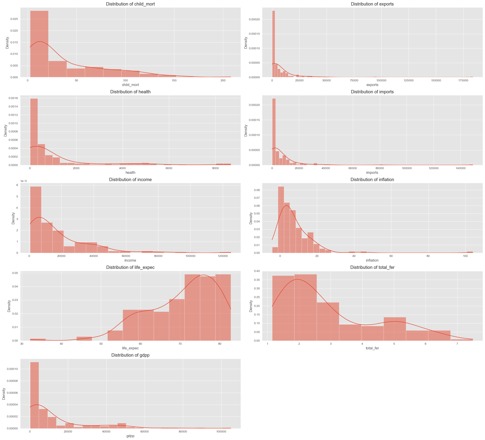
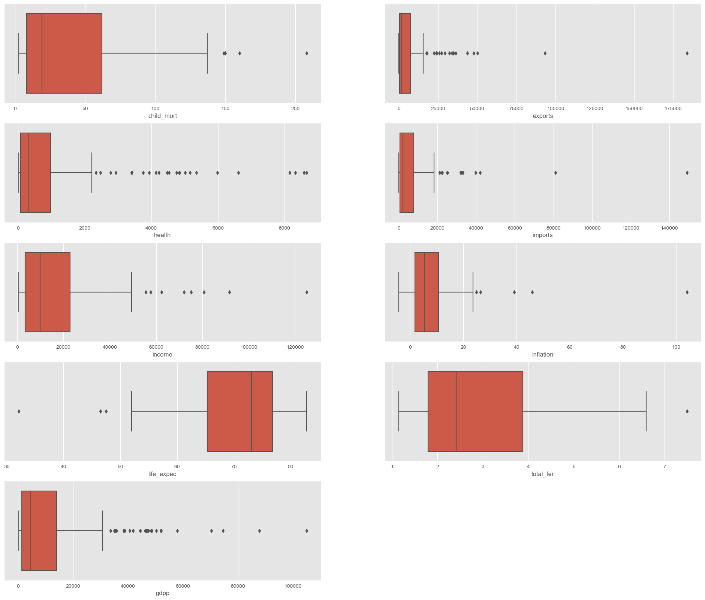
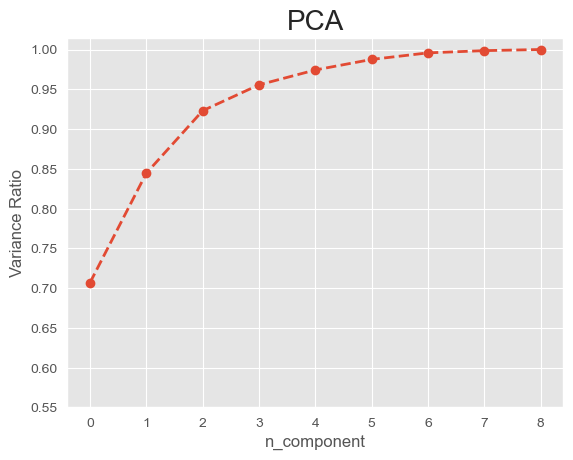
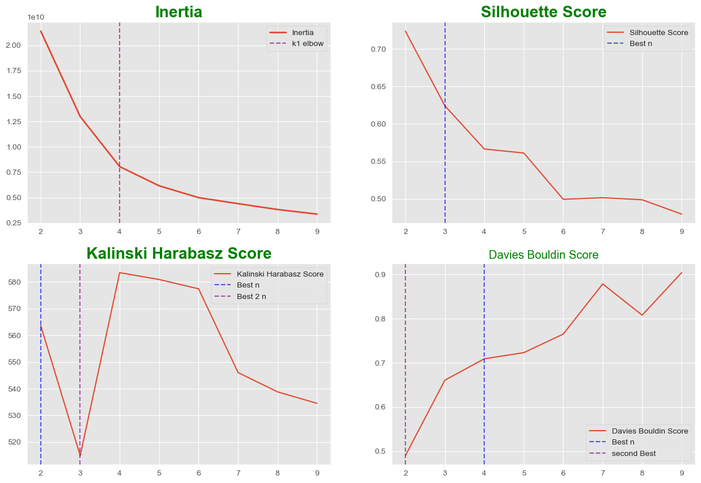
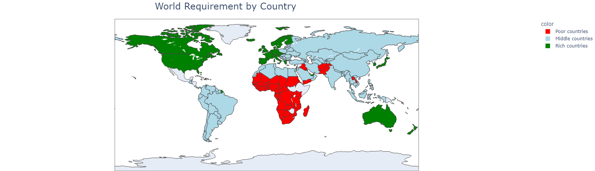
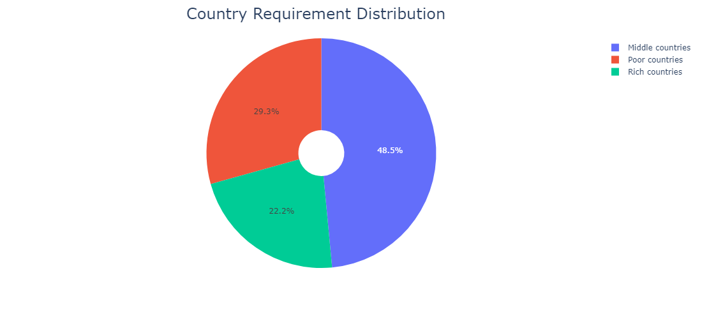

    
The notebook contains information about a project related to analyzing socioeconomic and health factors to categorize countries by their level of development. The goal of the project is to strategically allocate $10 million in aid to countries most in need.

1. Description: Provides an overview of the project's focus on analyzing socioeconomic and health factors to categorize countries by their level of development.

2. Problem: Explains the goal of HELP International and its aim to combat poverty by identifying countries in need of aid.

3. Goal: States the objective of strategically allocating $10 million in aid to countries based on their development needs.

4. Table of Contents: Outlines the sections and steps involved in the project.

5. Step 1: Necessary Libraries: Lists the libraries required for the project, such as pandas, numpy, matplotlib, seaborn, plotly, scikit-learn, and the kneed library.

6. Step 2: Dataset: Refers to the loading of the dataset, but the specific details are missing.

7. Step 3: Preprocessing: Covers various preprocessing tasks, including handling missing values, duplicated values, derived metrics, visualization, outliers, and normalization.

8. Step 4: PCA: Mentions the use of Principal Component Analysis for dimensionality reduction, but the implementation details are not provided.

9. Step 5: Clustering Models: Discusses the application of the K-means clustering algorithm and the evaluation of results using metrics such as silhouette score, Calinski-Harabasz score, and Davies-Bouldin score. However, specific implementation details are missing.

10. Finall visualization

Author: Mohammadaref Ahmadpoor

